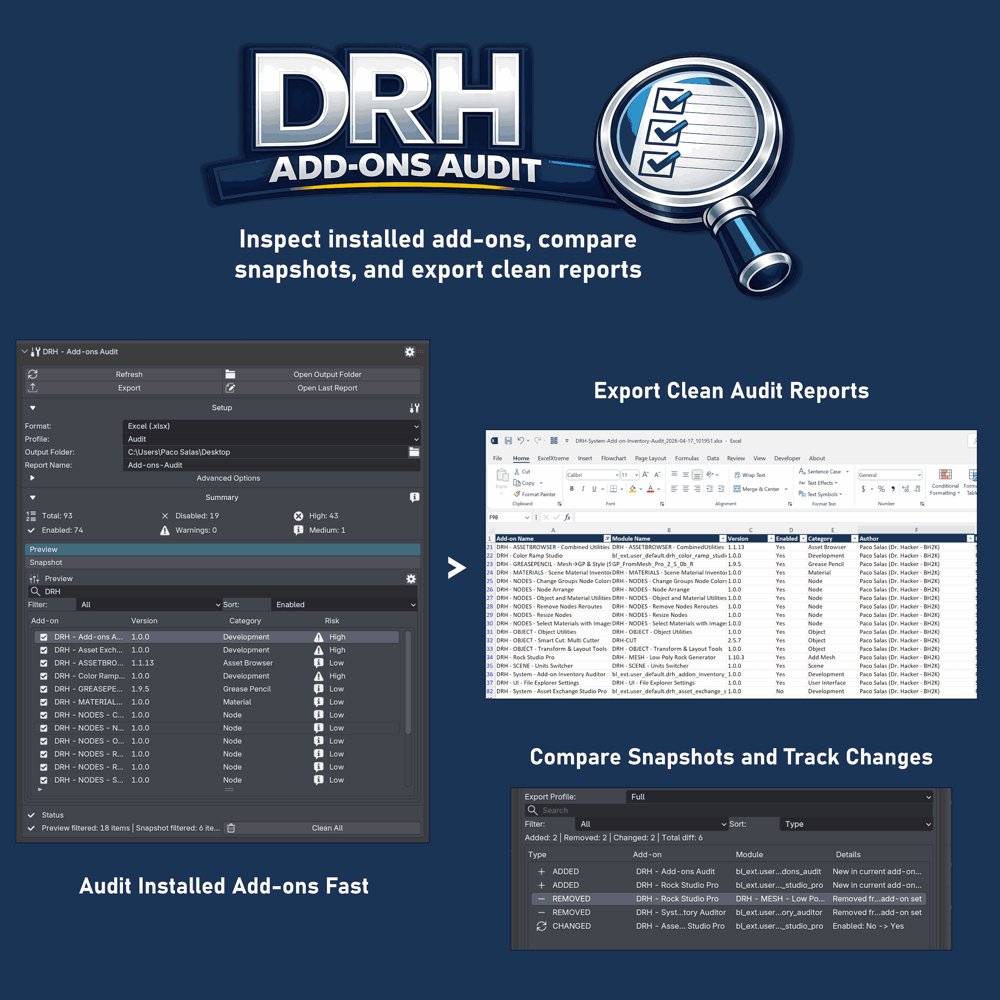
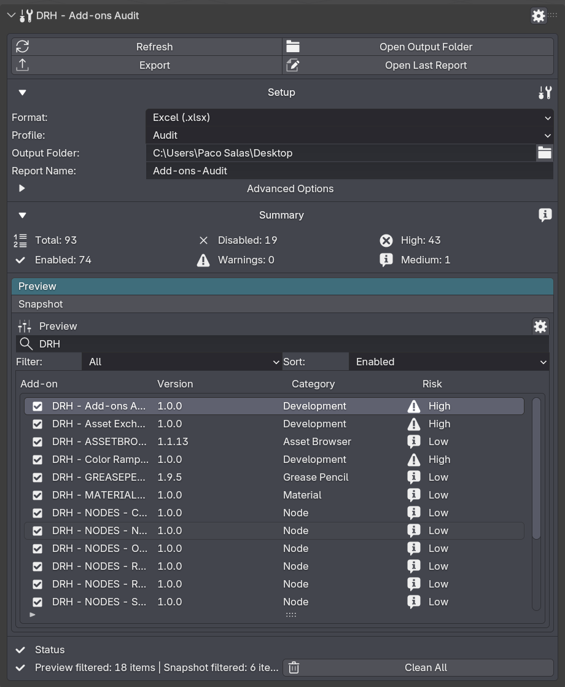
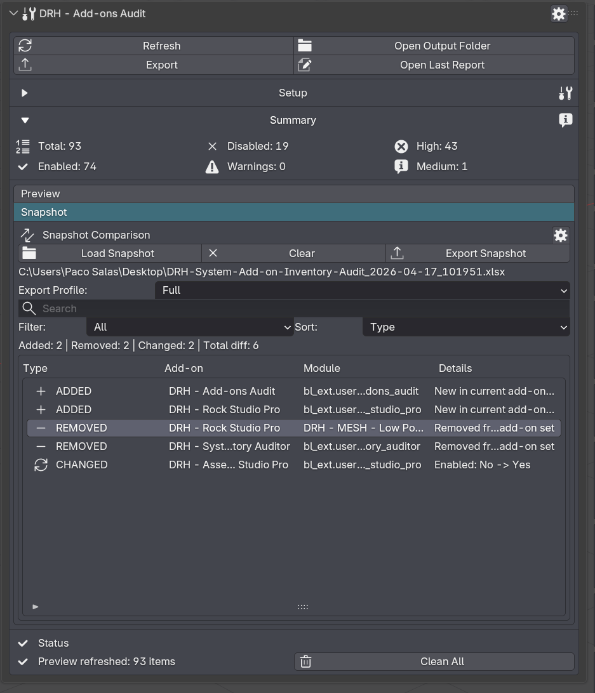
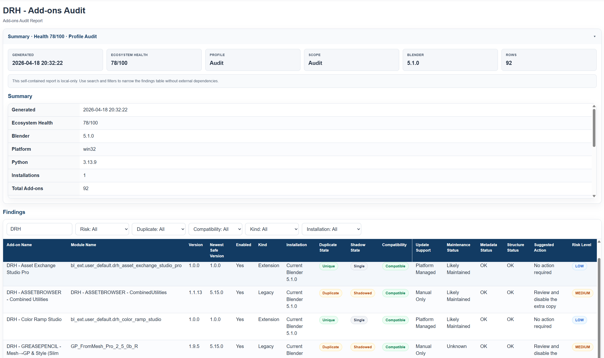
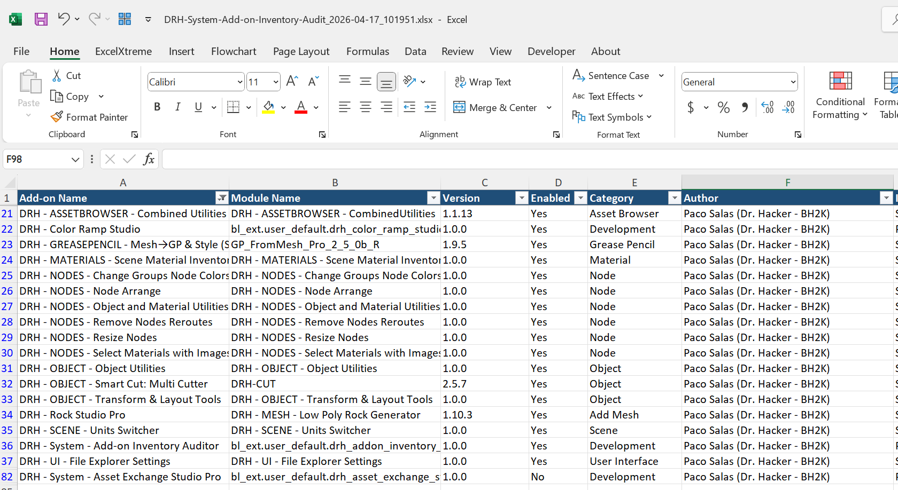

  

 

# DRH - Add-ons Audit

### Public Support Hub · Documentation · Feedback · Pre-release Validation

**A Blender utility for inspecting, documenting, comparing, and troubleshooting add-on setups.**

 

**Part of the DRH Add-ons ecosystem — Blender tools, updates, and releases.**

<!--

-->

---

**DRH - Add-ons Audit** helps Blender users understand what is installed, what changed, and how to document their add-on environment more clearly.

This repository is the central public hub for support, documentation, issue tracking, compatibility feedback, and community validation before marketplace release.

---

  
<strong>📚 Table of Contents</strong>

## Menu

- [Overview](#overview)
- [Media preview](#media-preview)
- [What DRH - Add-ons Audit does](#what-add-ons-audit-does)
- [Key features](#key-features)
- [Full feature list](#full-feature-list)
- [Who is it for?](#who-is-it-for)
- [Current status](#current-status)
- [Feedback wanted before release](#feedback-wanted-before-release)
- [Quick links](#quick-links)
- [Before you post](#before-you-post)
- [Where to post](#where-to-post)
- [Support policy](#support-policy)
- [Technical notes](#technical-notes)
- [Availability](#availability)
- [Documentation](#documentation)
- [License](#license)

---

## Overview

**DRH - Add-ons Audit** is a Blender workflow utility designed to help users inspect, compare, document, and troubleshoot their Blender add-on installations.

It is intended for users who work with multiple add-ons, maintain different Blender setups, test compatibility, migrate environments, or need clearer reports when diagnosing issues.

Instead of relying on memory or manual notes, DRH - Add-ons Audit helps turn your Blender add-on setup into structured, readable information.

## Media preview

  

<!--

---

### Demo video

Replace `YOUTUBE_VIDEO_ID` with your real YouTube video ID.

Example:
https://www.youtube.com/watch?v=YOUTUBE_VIDEO_ID

  
   
  Click the image to watch the demo on YouTube.

-->

<!--
### Quick demo GIF

Recommended size: 1280x720 or 960x540.

  

-->

### Early Screenshots

| Report Preview | Add-ons Snapshot |
|---|---|
|  |  |

<strong>More Screenshots...</strong>

| Report Preview | Add-ons Snapshot |
|---|---|
|  |  |

<!--
Temporary placeholder while media is not available.

Media preview coming soon.

-->

---

## What DRH - Add-ons Audit does

DRH - Add-ons Audit scans your Blender add-on environment and helps you create structured reports, snapshots, comparisons, and setup references.

It is not only an add-on list viewer. It is designed as a diagnostic and documentation tool for Blender add-on setups.

Use it to:

- Review installed add-ons
- Compare setup snapshots
- Detect changes between configurations
- Export readable reports
- Document your Blender add-on environment
- Prepare setup profiles
- Troubleshoot compatibility or installation issues
- Share clearer setup information when asking for support

---

## Key features

- Snapshot comparison to instantly see what changed between Blender add-on setups
- Metadata-based compatibility checks for safer upgrades and troubleshooting
- Duplicate and shadow-copy detection to clean up broken or confusing installs
- Exportable audit reports for support, documentation, and team handoff
- Full add-on inventory scanning with manifest and metadata parsing
- Setup profiles for repeatable environment reviews
- Operator and hotkey conflict heuristics for faster problem isolation
- Ecosystem Health summary for quick risk visibility
---

  
<strong>🧩 Full feature list</strong>

## Full feature list

### Inventory & Metadata

- Scan Blender add-on installations
- Build a full add-on inventory
- Read manifest and metadata fields
- Parse names, authors, versions, compatibility targets, and URLs
- Detect structure status and install type
- Support robust static `bl_info` parsing

### Compatibility & Risk Review

- Compatibility status detection
- Duplicate copy detection
- Version conflict detection
- Shadow-state detection
- Preferred local version resolution
- Risk level scoring
- Suggested action output
- Ecosystem Health score and executive summary

### Conflict Heuristics

- Possible operator conflict detection
- Possible hotkey conflict detection
- Issue summaries for manual review

### Snapshot & Change Tracking

- Create inventory snapshots
- Compare snapshots across setup changes
- Detect added add-ons
- Detect removed add-ons
- Detect changed add-ons
- Validate compare inputs against supported inventory exports

### Export & Reporting

- Export to HTML
- Export to JSON
- Export to CSV
- Export to TSV
- Export to XML
- Export to Markdown
- Export to XLSX
- Open output folder
- Open last generated report

### Profiles & Portability

- Import setup profiles
- Export setup profiles
- Portable setup support
- Path sanitization for safer report sharing

### UI & Workflow

- Preview tab workflow
- Snapshot tab workflow
- Filters and sorting
- Select all / clear selection helpers
- Minimum row controls
- Open selected install folder
- Reset defaults and cleanup actions

---

## Who is it for?

DRH - Add-ons Audit is designed for:

- Blender users with many installed add-ons
- Artists who work across multiple Blender setups
- Technical artists
- Pipeline and workflow-focused users
- Add-on developers
- Support teams and testers
- Users who frequently migrate or reinstall Blender
- Users who need clearer reports when troubleshooting problems

---

## Current status

| Item | Details |
|---|---|
| **Status** | 🟠 Production Ready, Pending Approval |
| **Current version** | 1.0.0 |
| **Minimum Blender version** | 4.2.0 |
| **Platforms** | Windows, macOS, Linux |
| **Release type** | Preparing for public marketplace release |
| **Support repository** | [DRH - Add-ons Audit Support](https://github.com/pacosalasv/DRH_Addons_Audit-Support) |

This add-on is production ready and currently pending marketplace approval. Compatibility feedback, usability comments, and workflow suggestions are welcome before public release.

---

## Feedback wanted before release

This repository is open for public feedback before marketplace release.

Feedback is especially welcome on:

- Feature usefulness
- Missing workflow options
- Compatibility concerns
- Report/export formats
- Snapshot comparison behavior
- Installation experience
- Documentation clarity
- Expected pricing
- Marketplace expectations

Useful feedback examples:

> “I would use this to compare two Blender installs.”

> “I need CSV export in addition to HTML/JSON.”

> “This should detect disabled add-ons separately.”

> “The report should include Blender version and OS.”

> “This would be useful, but only if it supports portable Blender installs.”

---

## Quick links

- [Support repository](https://github.com/pacosalasv/DRH_Addons_Audit-Support)
- [Ask a question in Discussions](https://github.com/pacosalasv/DRH_Addons_Audit-Support/discussions)
- [Open a new issue](https://github.com/pacosalasv/DRH_Addons_Audit-Support/issues/new/choose)
- [Report a bug](https://github.com/pacosalasv/DRH_Addons_Audit-Support/issues/new?template=bug_report.yml)
- [Request a feature](https://github.com/pacosalasv/DRH_Addons_Audit-Support/issues/new?template=feature_request.yml)
- [Report a compatibility issue](https://github.com/pacosalasv/DRH_Addons_Audit-Support/issues/new?template=compatibility_issue.yml)

---

## Before you post

Please include as much of the following information as possible:

- Add-on version
- Blender version
- Operating system
- Installation method
- Clear steps to reproduce
- Expected result
- Actual result
- Error message, screenshot, or console output when available

For compatibility issues, please also include:

- Blender build type, if known
- Portable or installed Blender version
- Add-on installation location
- Whether the issue happens with a clean Blender configuration

---

## Use Discussions for

- Questions
- How-to topics
- Installation help
- Compatibility checks
- FAQ
- Suggestions
- Pre-release feedback
- Pricing feedback
- Workflow ideas

---

## Use Issues for

- Confirmed bugs
- Reproducible compatibility problems
- Feature requests
- Regressions
- Marketplace or listing-related problems
- Documentation errors

---

## Where to post

Open a **Discussion** for:

- General questions
- Setup help
- Workflow advice
- Suggestions
- Early feedback

Open an **Issue** for:

- Confirmed bugs
- Reproducible compatibility problems
- Regressions
- Feature requests
- Documentation problems

---

## Support policy

This repository is a public support hub.

Do not post:

- Private account details
- License keys
- Payment information
- Confidential production files
- Private client files
- Sensitive system information

If a private file is required to reproduce an issue, please describe the problem first and wait for further instructions.

---

## Technical notes

This add-on is source based, with:

- No obfuscation
- No binary-only content
- No external services

File access is used to:

- Scan installations
- Read manifests
- Compare snapshots
- Export reports
- Create installable packages
- Import or export setup profiles

The add-on is intended to work locally inside Blender.

---

## Availability

This add-on may be available through multiple marketplaces and storefronts after release.

This GitHub repository remains the central public location for:

- Support
- Documentation
- Issue tracking
- Compatibility reports
- Public feedback
- Release notes

---

## Documentation

- [User Manual](docs/manual/user-manual.pdf)
- [Changelog](CHANGELOG.md)

---

## License

This repository is distributed under **GPL-3.0-or-later**.

---

### DRH Add-ons

**Blender tools, updates, and releases.**

Built for clean workflows, practical utilities, and production-friendly Blender setups.

