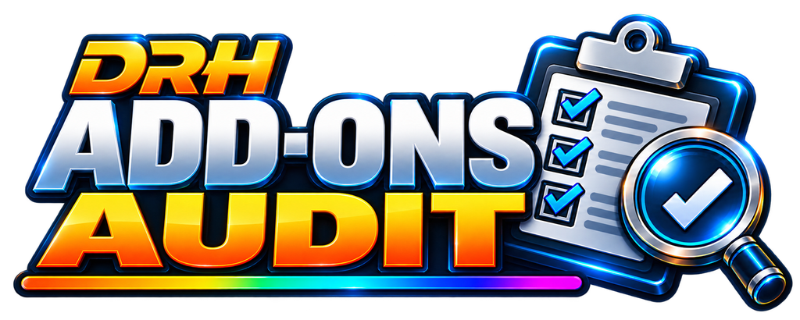
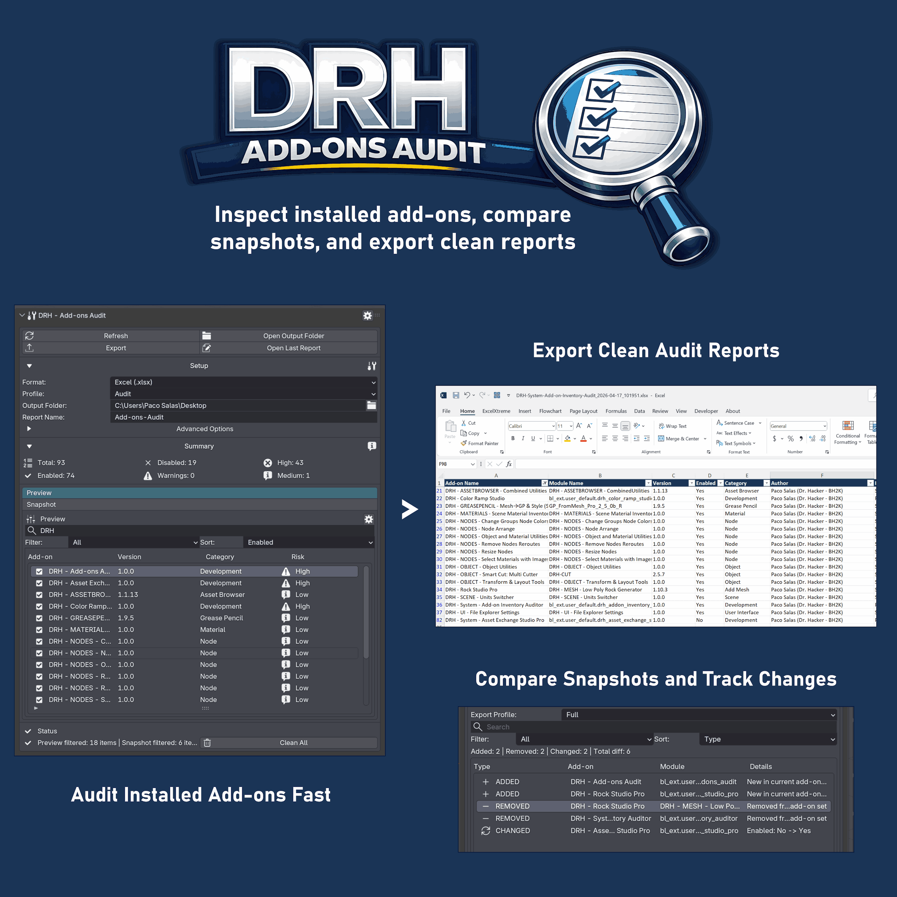
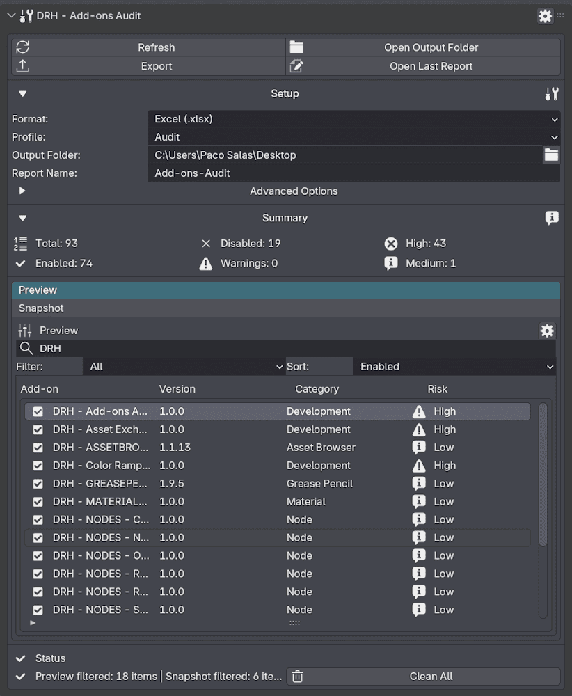
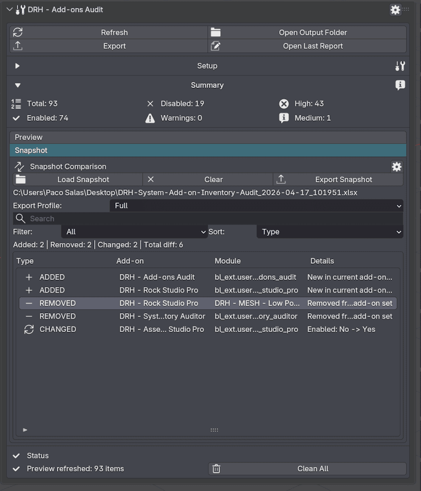
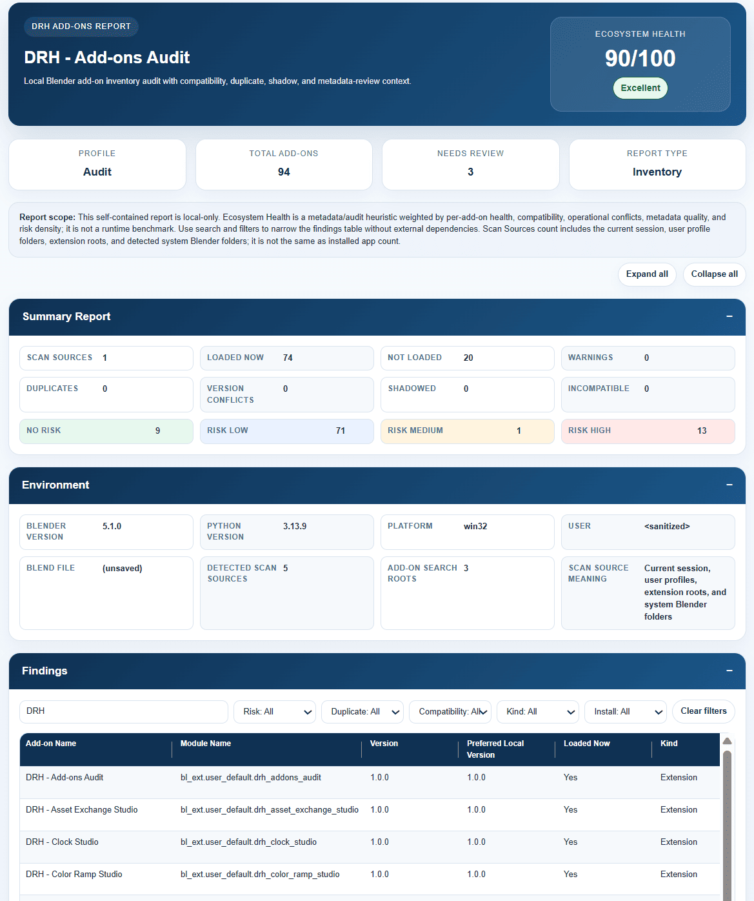
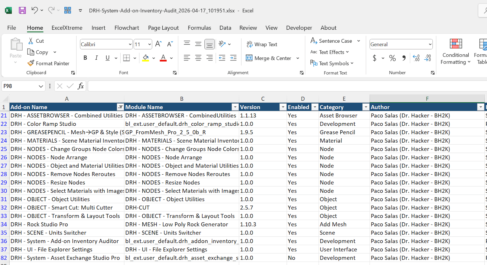

  

 

# DRH - Add-on Manager & Audit

### Support · Documentation · Feedback · Available on BlendKit

Audit, compare, and export Blender add-on inventories safely.

 

DRH Blender Tools: support, documentation, and release information.

---

A practical auditing and maintenance toolkit for Blender add-ons and extensions. It helps review installed tools, compatibility, duplicate and conflict states, snapshots, maintenance information, and exportable reports.

This repository is the public hub for support, documentation, issue tracking, and compatibility feedback for DRH - Add-on Manager & Audit.

---

> Repository note: the existing `DRH_Addons_Audit-Support` repository name is intentionally preserved for URL/history continuity; the current marketplace product name is DRH - Add-on Manager & Audit.

## Overview

A practical auditing and maintenance toolkit for Blender add-ons and extensions. It helps review installed tools, compatibility, duplicate and conflict states, snapshots, maintenance information, and exportable reports.

## Media preview

  

### Screenshots

| Audit overview | Inventory review |
|---|---|
|  |  |

| Comparison workflow | Report export |
|---|---|
|  |  |

## What it does

DRH - Add-on Manager & Audit helps users inspect and compare Blender add-on and extension inventories without changing the installed tools being audited.

## Capabilities

| Details |
|---|
| local add-on and extension inventory scanning |
| manifest and add-on metadata review |
| compatibility, duplicate, version-conflict, and shadow-state checks |
| operator and hotkey review candidates |
| snapshot comparison for maintenance workflows |
| exportable reports for troubleshooting and pipeline review |

## Status

- Status: 🟢 Released
- Version: 1.0.0
- Official distribution is available through [BlendKit](https://www.blendkit.com/asset-gallery-detail/89fe5b10-df59-4940-b66e-8e8114e9fd53/).

## Availability

The released add-on is distributed through [BlendKit](https://www.blendkit.com/asset-gallery-detail/89fe5b10-df59-4940-b66e-8e8114e9fd53/). GitHub remains the public support and documentation location.

## Documentation

- [User manual](docs/manual/user-manual.pdf)
- [Manual changelog](docs/manual/manual-changelog.md)
- [Product changelog](CHANGELOG.md)
- [Support guide](SUPPORT.md)

## Support

Use [GitHub Discussions](https://github.com/pacosalasv/DRH_Addons_Audit-Support/discussions) for setup questions, workflow guidance, usage help, and general feedback. Use [GitHub Issues](https://github.com/pacosalasv/DRH_Addons_Audit-Support/issues/new/choose) for reproducible bugs, regressions, compatibility problems, and focused feature requests.

See [SUPPORT.md](SUPPORT.md) for the shared DRH support format, the information to include in a report, and public-information guidance.

## Support DRH development

DRH development support is optional. Ko-fi contributions help cover maintenance, Blender compatibility work, documentation, testing, and continued development of free tools.

  

## Ecosystem links

- [DRH Add-ons Hub](https://github.com/pacosalasv/DRH_Addons_Hub)
- [BlendKit](https://www.blendkit.com/asset-gallery-detail/89fe5b10-df59-4940-b66e-8e8114e9fd53/)
- [Paco Salas | DRH on GitHub](https://github.com/pacosalasv)
- [Ko-fi](https://ko-fi.com/pacosalasv)

---

Authored by Paco Salas | DRH.
